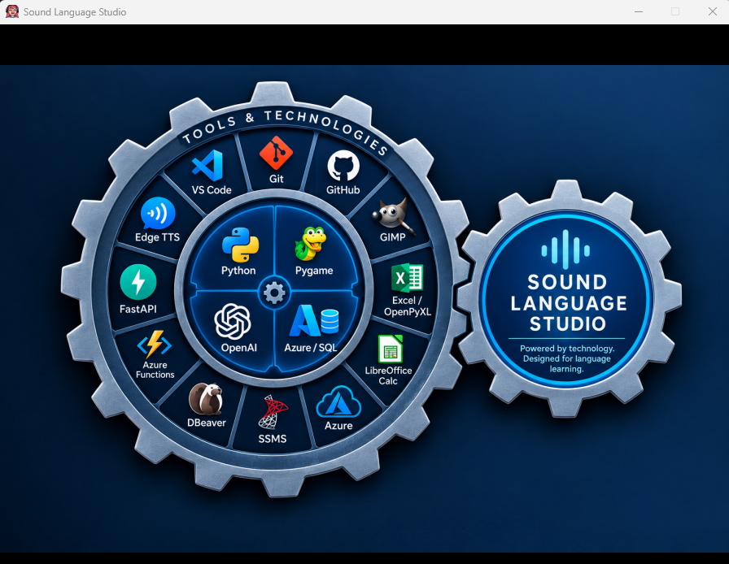
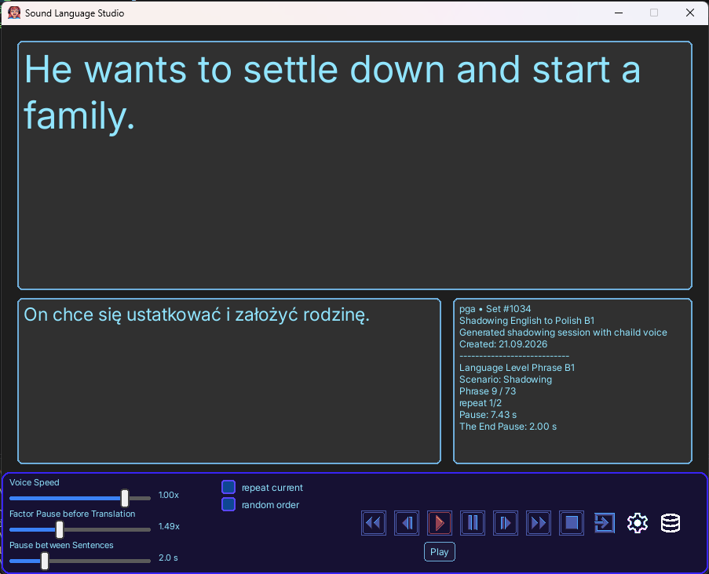
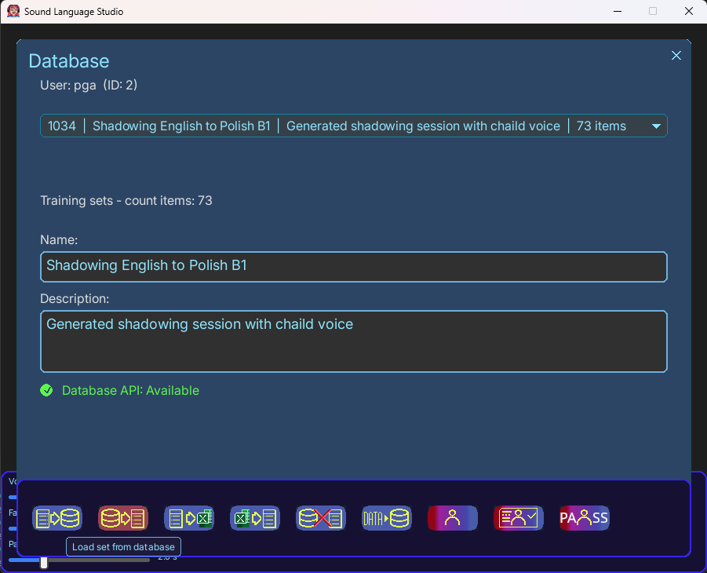
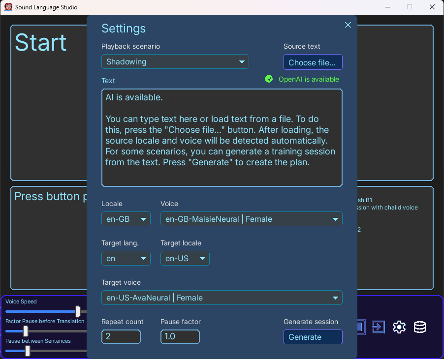

# Sound Language Studio

**Sound Language Studio** is a free desktop application for language learning through listening, speaking, and interactive practice.

The project is built around the **Shadowing** learning method, with **Dictation** and other learning scenarios being developed as part of the application.

The main goal of the project is to provide a convenient, non-intrusive environment for practicing languages with audio, speech, and interactive learning materials.

## Features

* 🎧 **Shadowing** — practice speaking and pronunciation by following spoken language.
* ✍️ **Dictation** — develop listening comprehension by transcribing spoken language.
* 🔊 **Text-to-Speech** — generate speech for learning materials.
* 🤖 **AI-assisted learning** — use AI to generate and prepare learning content.
* 🌍 **Multiple languages and CEFR levels** — organize learning materials by language and level.
* 💾 **Learning sets** — create, edit, store, and manage learning materials.
* 📊 **Excel import/export** — exchange learning sets using Excel files.
* ☁️ **Optional Database API** — store and synchronize learning sets using a remote database.
* ⚙️ **Service status information** — see the availability of optional external services directly in the application.

## Shadowing

- [Shadowing — Introduction (RU)](docs/shadowing_intro_ru.md)
- [Shadowing — Introduction (EN)](docs/shadowing_intro_en.md)

## Screenshots

### Start



### Main Window



### Database



### Settings



## Documentation

The complete project documentation is available online:

**[📖 Sound Language Studio Documentation](https://peisakhovich.github.io/ShatdowingPlayer_SA_03/)**

The documentation contains information about:

* application architecture;
* project structure;
* Python modules;
* graphical user interface;
* audio and text-to-speech components;
* AI and language-processing components;
* learning sessions and learning sets;
* database API;
* development and documentation tools.

## Technology

Sound Language Studio is developed with **Python 3.12**.

Main technologies and libraries include:

* Python
* pygame-ce
* pygame_gui
* OpenAI API
* Azure Functions
* SQL Server
* edge-tts
* httpx
* openpyxl
* MkDocs
* mkdocstrings

## Project Structure

The main project components are organized as follows:

```text
SA_03/
├── ai/             # AI and language-processing components
├── api/            # Database API client
├── audio/          # Audio playback and text-to-speech
├── core/           # Application core and configuration
├── gui/            # Graphical user interface
├── session/        # Sessions and learning sets
├── tools/          # Development and documentation tools
├── utils/          # Utility modules
├── docs/           # Project documentation
├── main.py         # Application entry point
└── mkdocs.yml      # MkDocs configuration
```

## Development Status

Sound Language Studio is an **actively developed project**.

The application architecture and functionality are evolving as new learning scenarios, interface components, AI features, and supporting tools are added.

The project is currently focused on development and experimentation with practical language-learning technologies.

## Running the Application

The project is developed and tested on Windows using Python 3.12.

Create a virtual environment:

```powershell
py -m venv .venv
```

Activate it:

```powershell
.venv\Scripts\Activate.ps1
```

Install the project dependencies:

```powershell
pip install -r requirements.txt
```

Run the application:

```powershell
py main.py
```

Optional services such as AI and the remote Database API are configured separately through the `.env` file.

## Documentation Development

The project documentation is built with **MkDocs**.

Start the local documentation server:

```powershell
mkdocs serve
```

Then open:

```text
http://127.0.0.1:8000/
```

Documentation is automatically built and published to GitHub Pages through GitHub Actions when changes are pushed to the `main` branch.

## Contributing

Suggestions, bug reports, and improvements are welcome.

Before making significant changes, please review the project documentation and the existing application architecture.

## Application Modes

Sound Language Studio can operate in three modes depending on the availability of optional API services.

### Local Mode

No external API services are available.

Core functionality remains available, including:

* Shadowing;
* Dictation;
* Text-to-Speech;
* local learning sets;
* Excel import and export.

### AI Mode

The AI service is available.

All Local Mode functionality remains available, with additional AI-assisted learning features.

### Full Mode

Both the AI service and Database API are available.

All currently implemented application features are available, including AI-assisted learning and remote learning-set storage.

The AI service and Database API operate independently. If one service is unavailable, the functionality that does not depend on it remains available.

> See [Application Modes & API Configuration](application_modes.md) for details about API configuration and access keys.

## License

Sound Language Studio is released under the MIT License.

---

**Sound Language Studio**

*A free desktop environment for language learning through listening, speaking, and interactive practice.*

