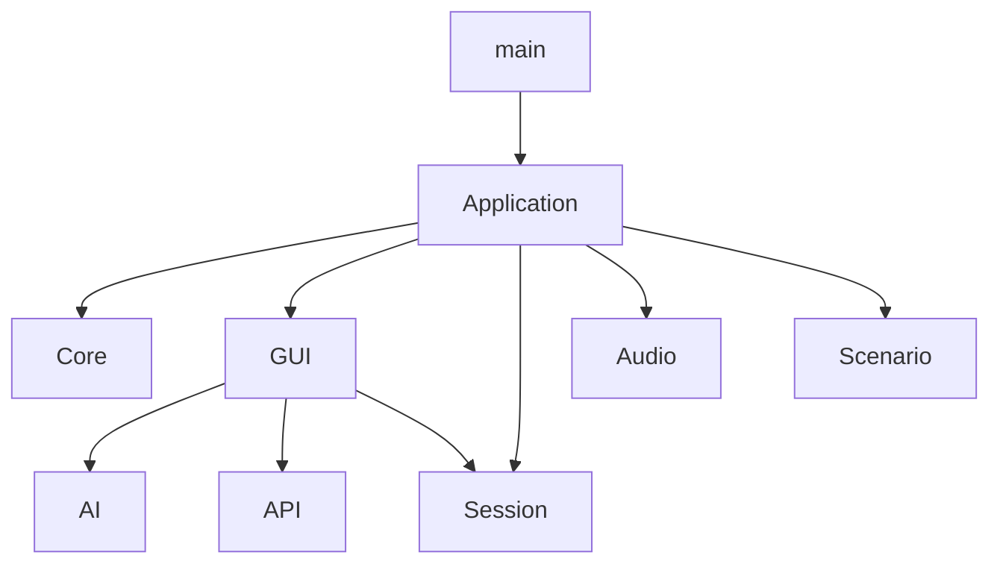
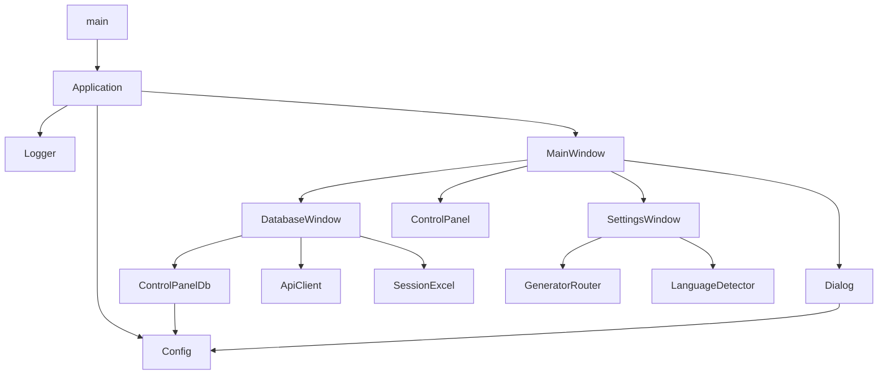
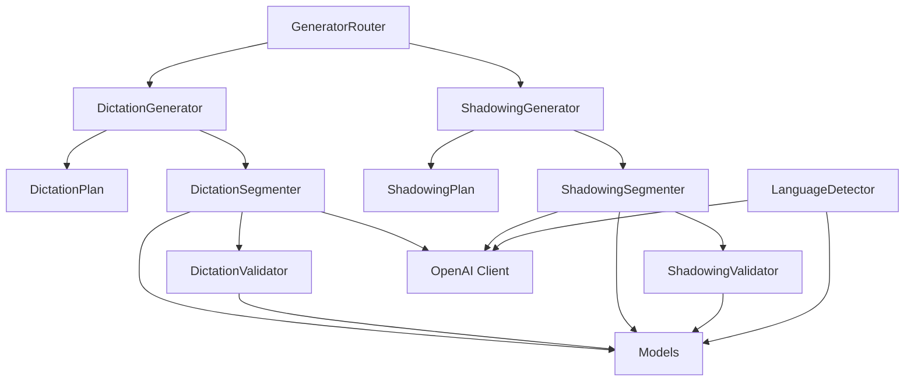
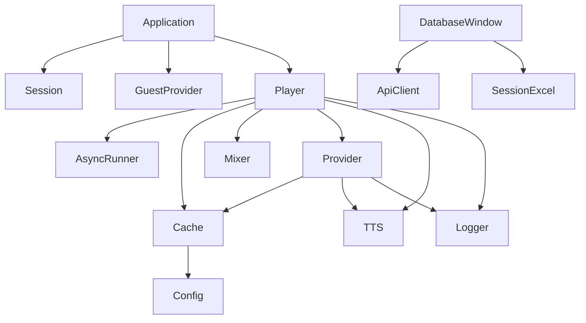

# Architecture

## Общая архитектура

Sound Language Studio состоит из нескольких взаимодействующих подсистем. Центральную роль в запуске и сборке приложения играет `core.application.Application`.

Основные подсистемы:

* **Core** — запуск приложения, конфигурация и системные службы;
* **GUI** — графический интерфейс пользователя;
* **AI** — обработка текста и формирование тренировочных планов;
* **Audio** — синтез, кэширование и воспроизведение аудио;
* **Session** — пользовательская сессия и работа с учебными наборами;
* **API** — взаимодействие с серверной частью;
* **Scenario** — выполнение сценариев тренировок.

---

## 1. Общая карта приложения

Эта схема показывает основные подсистемы и их взаимодействие без детализации отдельных модулей.



Эта карта предназначена для быстрого понимания общей структуры приложения.

---

## 2. Core и GUI

Основной поток запуска приложения проходит через `Application`, который создаёт и связывает основные компоненты интерфейса.



### Основные связи

`Application` является точкой сборки приложения.

`MainWindow` управляет основными окнами и панелями пользовательского интерфейса.

`DatabaseWindow` обеспечивает работу с учебными наборами и использует:

* `ControlPanelDb` для управления элементами интерфейса базы данных;
* `ApiClient` для взаимодействия с API;
* `SessionExcel` для импорта и экспорта данных.

`SettingsWindow` взаимодействует с AI-компонентами, необходимыми для настройки генерации тренировочных материалов.

---

## 3. AI

AI-подсистема разделена на два основных направления:

* **Dictation**;
* **Shadowing**.

Оба направления используют собственные генераторы, планы, сегментаторы и валидаторы, при этом общая структура обработки остаётся одинаковой.



### Принцип работы

`GeneratorRouter` определяет необходимый генератор.

Далее:

```text
GeneratorRouter
      │
      ├── DictationGenerator
      │       ├── DictationPlan
      │       └── DictationSegmenter
      │
      └── ShadowingGenerator
              ├── ShadowingPlan
              └── ShadowingSegmenter
```

Сегментаторы используют:

* модели данных `Models`;
* `OpenAI Client`;
* соответствующие валидаторы.

`LanguageDetector` используется отдельно для определения языка текста.

---

## 4. Audio, Session и API

Эта схема показывает подсистемы, связанные с воспроизведением, пользовательской сессией и хранением учебных наборов.



### Audio

`Player` является центральным компонентом аудиоподсистемы.

Он использует:

* `AsyncRunner` — выполнение асинхронных операций;
* `Cache` — кэширование аудио;
* `Mixer` — управление аудиомикшированием;
* `Provider` — получение аудио;
* `TTS` — синтез речи;
* `Logger` — журналирование.

### Session

`Application` создаёт пользовательскую `Session` и `GuestProvider`.

`SessionExcel` используется `DatabaseWindow` для работы с Excel-файлами учебных наборов.

### API

`DatabaseWindow` взаимодействует с серверной частью через `ApiClient`.

---

## Основные архитектурные связи

### Application

`Application` является центральной точкой запуска и связывает основные подсистемы приложения.

Он отвечает за создание:

* главного окна;
* пользовательской сессии;
* аудиоплеера;
* провайдера сценариев;
* конфигурации;
* системного логгера.

### GUI

GUI отвечает за взаимодействие пользователя с приложением.

Основные компоненты:

* `MainWindow`;
* `DatabaseWindow`;
* `SettingsWindow`;
* `ControlPanel`;
* `ControlPanelDb`;
* `Dialog`.

### AI

AI-подсистема отвечает за:

* генерацию тренировочных материалов;
* сегментацию текста;
* определение языка;
* валидацию результата;
* взаимодействие с OpenAI API.

### Audio

Audio отвечает за:

* синтез речи;
* получение аудио;
* кэширование;
* микширование;
* воспроизведение;
* асинхронные операции.

### Session

Session отвечает за:

* текущего пользователя;
* пользовательские данные;
* учебные наборы;
* гостевой режим;
* импорт и экспорт наборов.

### API

API предоставляет взаимодействие приложения с серверной частью.

`ApiClient` используется GUI для операций с пользовательскими наборами и другими серверными данными.

### Scenario Provider

`ScenarioProvider` отвечает за работу со сценариями тренировок.

Сценарии определяют последовательность действий во время учебной сессии.

---

## Принцип разделения ответственности

Архитектура Sound Language Studio построена таким образом, чтобы основные области ответственности были разделены между отдельными подсистемами.

```text
Core
 │
 ├── Application
 ├── Config
 └── Logger
       │
       ▼
GUI ───────────► AI
 │                │
 │                ▼
 ├────────────► API
 │
 ├────────────► Session
 │
 └────────────► Audio
                    │
                    ▼
                 Scenario
```

Такое разделение позволяет развивать отдельные части приложения независимо и постепенно добавлять новые учебные сценарии и возможности.

---

## Детальная документация

Подробная документация отдельных модулей доступна в разделе **Modules**.

Каждая страница модуля содержит:

* архитектурные зависимости;
* зависимости стандартной библиотеки Python;
* сторонние библиотеки;
* автоматически сгенерированную документацию API.
