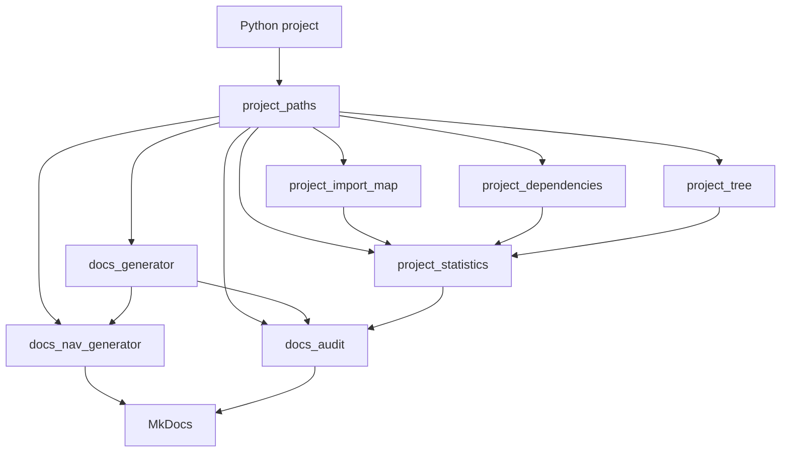
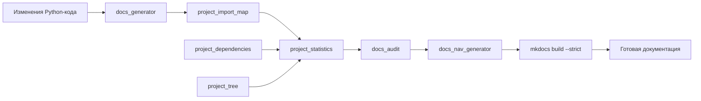

# Tools Architecture

## Назначение

Пакет `tools` содержит служебные модули Sound Language Studio, предназначенные для анализа проекта, формирования документации и контроля её состояния.

Эти инструменты не входят в runtime-архитектуру приложения и используются при разработке и сопровождении проекта.

## Модули Tools

| Module                 | Purpose                                   |
| ---------------------- | ----------------------------------------- |
| `project_paths`        | Общие пути проекта                        |
| `project_import_map`   | Анализ импортов и внутренних зависимостей |
| `project_dependencies` | Анализ внешних зависимостей               |
| `project_statistics`   | Формирование статистики проекта           |
| `project_tree`         | Формирование структуры проекта            |
| `docs_generator`       | Генерация страниц документации модулей    |
| `docs_nav_generator`   | Генерация навигации MkDocs                |
| `docs_audit`           | Проверка документации                     |

## Взаимодействие модулей



## Поток подготовки документации

После изменений в Python-коде документация обновляется последовательностью:



## Роли модулей

### `project_paths`

Определяет корень проекта и предоставляет общий путь для остальных инструментов.

### `project_import_map`

Анализирует Python-модули и их импорты, определяя внутренние зависимости, стандартную библиотеку и сторонние библиотеки.

### `project_dependencies`

Формирует информацию о зависимостях проекта.

### `project_statistics`

Использует результаты анализа проекта для формирования статистики в `docs/project_statistics.md`.

### `project_tree`

Формирует текстовое представление структуры проекта в `docs/project_structure.txt`.

### `docs_generator`

Создаёт и обновляет страницы документации Python-модулей в `docs/modules/`.

### `docs_nav_generator`

Формирует навигацию MkDocs на основе структуры документации и записывает её в `docs/docs_nav.yml` и `mkdocs.yml`.

### `docs_audit`

Проверяет документацию модулей и формирует отчёт о найденных проблемах.

## Результаты работы

Основные результаты работы `tools`:

```text
docs/
├── docs_nav.yml
├── project_statistics.md
├── project_structure.txt
└── modules/
    └── ...

data/
├── dependency_inventory.txt
├── docs_audit.txt
└── import_map.txt
```

После обновления документации выполняется:

```powershell
mkdocs build --strict
```

Если сборка проходит без ошибок и предупреждений, документация готова к публикации.
